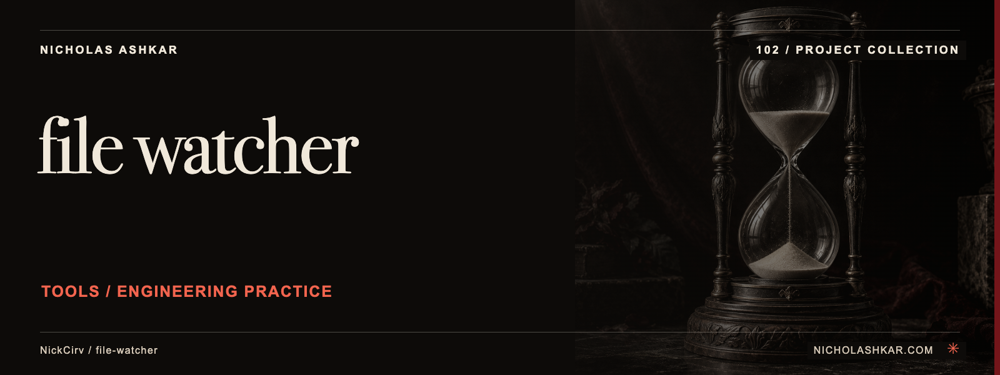

# file-watcher

Run a chosen command when matching local files change.


<a id="usage"></a>

## What it does

Provides fs.watch and polling modes, extension/glob filtering, debounce, initial execution and one-shot operation. Reads .watchrc unless --no-watchrc is set. See the pinned [implementation](https://github.com/NickCirv/file-watcher/blob/d67e37e91537184be71106820c64be2d564e2149/index.js).


<a id="install"></a>

## Quickstart

Node requirement from the inspected manifest: **`>=20`**. Use a harmless command to check the watch scope before connecting build or mutation tasks.

The following example is **source-inspected, not executed**. It uses a pinned checkout; npm package publication is not assumed. Replace project paths or provide the stated input fixtures before running it.

```bash
git clone https://github.com/NickCirv/file-watcher.git
cd file-watcher
git checkout d67e37e91537184be71106820c64be2d564e2149
npm install --ignore-scripts
node index.js ../your-project/src --ext js,ts -- node --version
```

Dependencies are installed with lifecycle scripts disabled in this recipe. Read the package scripts before enabling any lifecycle step required by your environment.

## Usage and reference

`file-watcher` | `fw` are the executable names declared by the package. [Command reference](docs/REFERENCE.md) covers source-backed options and entry points.

| Control | Behavior in the inspected implementation |
| --- | --- |
| `PATH` | Select a watch root or pattern |
| `--ext LIST` | Filter file extensions |
| `--poll MS` | Use interval polling |
| `--initial` | Run once at startup |
| `-- COMMAND` | Separate watcher options from child-command arguments |

## Limits and operational notes

The child command inherits environment variables and executes with your permissions. File-event behavior varies across operating systems and mounted filesystems. Put watcher flags before the -- separator; arguments after it belong to the child.

## Development

No runtime checks were executed for this documentation review. The committed smoke test checks entrypoint JavaScript syntax; it does not exercise the command behavior.

| Script | Declared command |
| --- | --- |
| `test` | `node --test` |

Work from the pinned source, keep changes focused, and reproduce the affected behavior with a small fixture before proposing a change. Existing contribution and security policies remain authoritative where present.

## Research and status

[Research record](docs/RESEARCH.md) identifies the inspected revision, source evidence, documentation disposition and verification gaps. Static inspection supports the descriptions here; runtime behavior, dependency installation and current hosted services remain unverified.

## License and author

[License](https://github.com/NickCirv/file-watcher/blob/d67e37e91537184be71106820c64be2d564e2149/LICENSE)

[Nicholas Ashkar](https://nicholashkar.com) · Applied AI, systems and consulting.
